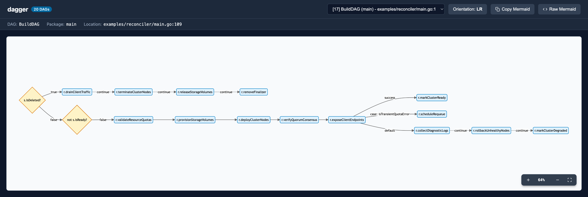

# dagger

[![test][github-workflow-badge]][github-workflow]
[![codecov][coverage-badge]][codecov]
[![PkgGoDev][pkg-go-dev-badge]][pkg-go-dev]
[![Go Report Card][go-report-card-badge]][go-report-card]

`dagger` is a lightweight, type-safe Go library for composing, executing, and visualizing **Directed Acyclic Graphs (DAGs)**.

It provides composable control-flow primitives to model complex business workflows, declarative state reconcilers (such as Kubernetes operators and cloud resource orchestrators), multi-step transactional routines, and data processing pipelines without deeply nested conditionals or spaghetti code.

---

## Features

- 🛡️ **Compile-Time Type Safety**: Built with Go generics (`Step[S]`), passing strongly typed state throughout your entire pipeline without reflection overhead or `any` casts.
- 🔄 **Graph Validation & Cycle Detection**: Automatically detects cycles and structural flaws during graph construction before any step executes.
- 🔀 **Expressive Control Flow**:
  - `Series`: Sequential pipelines that halt on the first error.
  - `Continue`: Resilient pipelines that execute all steps and accumulate errors with `errors.Join`.
  - `If`, `IfNot`, `IfElse`: State-driven conditional branching using predicate selectors.
  - `Result`: Flexible outcome branching (`OnSuccess`, `OnError`), contextual error access (`NewResultErrStep`), and multi-branch error pattern matching (`Switch`, `Case`, `DefaultCase`).
- 🔌 **Composable Middlewares**: Intercept steps for cross-cutting observability, including distributed tracing (OpenTelemetry, Datadog), structured logging (`slog`, `logr`), latency histograms, and retries.
- 🏷️ **Zero-Boilerplate Step Introspection**: Reflection-based namer automatically extracts clean, human-readable names for standalone functions, struct methods (`*Service.Method`), and generic types.
- 🌳 **DAG Visualization**: Built-in ASCII/Unicode tree printer (`Print`, `PrintString`) for inspecting, logging, and debugging DAG topologies at runtime or during tests.
- 📊 **Interactive Web Visualizer & CLI (`cmd/dagger`)**: Statically discovers all DAGs across your codebase using Go's standard library AST parser, renders Mermaid.js flowcharts, and serves an interactive web dashboard with pan/zoom and orientation toggles—pure stdlib, zero third-party dependencies!

---

## Installation

```bash
go get github.com/ajatprabha/dagger
```

---

## Quick Start

```go
package main

import (
	"context"
	"fmt"
	"log"

	"github.com/ajatprabha/dagger"
)

// 1. Define your workflow state
type ProvisionState struct {
	ResourceID string
	ClusterIP  string
	Ready      bool
}

// 2. Define steps as functions
func allocateIP(ctx context.Context, state *ProvisionState) error {
	state.ClusterIP = "10.0.0.42"
	fmt.Printf("Allocated IP: %s\n", state.ClusterIP)
	return nil
}

func verifyHealth(ctx context.Context, state *ProvisionState) error {
	state.Ready = true
	fmt.Println("Health check passed")
	return nil
}

func main() {
	// 3. Compose steps into a pipeline
	pipeline := dagger.Series(
		dagger.NewStep(allocateIP),
		dagger.NewStep(verifyHealth),
	)

	// 4. Initialize executor with cycle validation
	dag, err := dagger.New(pipeline)
	if err != nil {
		log.Fatalf("Invalid DAG: %v", err)
	}

	// 5. Execute with initial state
	state := &ProvisionState{ResourceID: "res-123"}
	if err := dag.Exec(context.Background(), state); err != nil {
		log.Fatalf("Pipeline failed: %v", err)
	}

	fmt.Printf("Resource %s provisioned successfully (Ready=%t)\n", state.ResourceID, state.Ready)
}
```

---

## Core Concepts

### 1. State (`S any`)
State in `dagger` is parameterized via Go generics. It is passed to every step during execution, allowing steps to read input, record intermediate progress, and persist output:

```go
type OrderState struct {
    OrderID string
    UserID  string
    Total   float64
    Paid    bool
}
```

### 2. Step (`Step[S any]`)
The fundamental unit of execution in `dagger` is the `Step[S]` interface:

```go
type Step[S any] interface {
    Exec(ctx context.Context, state S) error
}
```

You can implement `Step[S]` directly with custom structs or adapt standard Go functions using `dagger.NewStep`:

```go
step := dagger.NewStep(func(ctx context.Context, state *OrderState) error {
    // business logic here
    return nil
})
```

### 3. Executor (`Executor[S any]`)
The `Executor[S]` holds the validated DAG and configured middlewares. Building an executor via `dagger.New` verifies that the graph is free of cycles:

```go
dag, err := dagger.New(startStep)
if err != nil {
    // Returns *dagger.ErrInvalid or *dagger.ErrCycle if cyclic
    log.Fatalf("DAG validation failed: %v", err)
}

if err := dag.Exec(ctx, state); err != nil {
    log.Printf("Execution failed: %v", err)
}
```

---

## Control Flow Constructs

`dagger` provides built-in control-flow steps to construct branching and sequential workflows:

### `Series` (Fail-Fast Sequence)
Executes steps sequentially. If any step returns an error, execution stops immediately and returns that error:

```go
pipeline := dagger.Series(
    dagger.NewStep(fetchUserData),
    dagger.NewStep(validateOrder),
    dagger.NewStep(chargePayment),
)
```

### `Continue` (Best-Effort Sequence)
Executes all steps in sequence regardless of errors. Encountered errors are accumulated and combined using `errors.Join`:

```go
// Ideal for teardown, multi-resource cleanup, or multi-check validations
cleanup := dagger.Continue(
    dagger.NewStep(drainConnections),
    dagger.NewStep(deleteCloudInstances),
    dagger.NewStep(releaseFloatingIP),
    dagger.NewStep(deleteDnsRecord),
)
```

### `If`, `IfNot`, and `IfElse` (State Branching)
Branch execution conditionally based on the state using a `Selector[S]` predicate (`func(state S) bool`):

```go
isDryRun := func(s *OrderState) bool { return s.Total == 0 }

workflow := dagger.IfElse(
    isDryRun,
    dagger.NewStep(skipPaymentProcessing),
    dagger.NewStep(processCreditCard),
)
```

`IfNot` executes the child step only when the selector returns `false`:

```go
dagger.IfNot(
    func(s *OrderState) bool { return s.Paid },
    dagger.NewStep(promptPayment),
)
```

### `Result` (Outcome & Error Routing)
`Result` executes a `mainStep`, followed by outcome-based branch routing:
- `dagger.OnSuccess(step)` runs if `mainStep` succeeds (`nil` error).
- `dagger.OnError(step)` runs if `mainStep` returns an error.
- `dagger.Switch(...)` enables multi-case pattern matching against the returned error.

#### Simple Success and Error Handling
```go
deployWithNotification := dagger.Result(
    dagger.NewStep(deployService),
    dagger.OnSuccess(dagger.NewStep(sendSlackNotification)),
    dagger.OnError(dagger.NewStep(triggerAlertPager)),
)
```

> **Note:** Either `OnSuccess`, `OnError`, or `Switch` must be provided. You can provide only `OnSuccess`, only `OnError`, or both.

#### Accessing the Triggering Error (`NewResultErrStep`)
If your failure step needs direct access to the error returned by `mainStep`, use `dagger.NewResultErrStep`:

```go
handleFailure := dagger.NewResultErrStep(func(ctx context.Context, state *OrderState, resErr error) error {
    log.Printf("Payment failed with error: %v", resErr)
    state.Paid = false
    // You can handle/suppress the error or return a wrapped error
    return fmt.Errorf("order %s failed: %w", state.OrderID, resErr)
})

orderStep := dagger.Result(
    dagger.NewStep(chargeCard),
    dagger.OnError(handleFailure),
)
```

#### Multi-Error Pattern Matching with `Switch` and `Case`
`dagger.Switch` routes errors to specific recovery steps based on predicate matchers, falling back to an optional `DefaultCase`:

```go
isNetworkError := func(ctx context.Context, err error) bool {
    var netErr net.Error
    return errors.As(err, &netErr)
}

isRateLimitError := func(ctx context.Context, err error) bool {
    return errors.Is(err, ErrRateLimited)
}

resilientStep := dagger.Result(
    dagger.NewStep(callExternalAPI),
    dagger.OnSuccess(dagger.NewStep(recordAPISuccess)),
    dagger.Switch[*OrderState](
        dagger.Case(isNetworkError, dagger.NewStep(retryWithExponentialBackoff)),
        dagger.Case(isRateLimitError, dagger.NewStep(queueForDelayedProcessing)),
        dagger.DefaultCase(dagger.NewStep(recordFatalAPIError)),
    ),
)
```

---

## Middlewares & Observability

`dagger` includes a middleware system that wraps steps with cross-cutting concerns such as distributed tracing, structured logging, retries, and telemetry metrics.

### How Middlewares Work

Middlewares are defined as `MiddlewareFunc[S]`:

```go
type MiddlewareFunc[S any] func(next Step[S], info Info) Step[S]
```

The `Info` struct provides metadata about the wrapped step:
- `info.Name`: String representation of the step (e.g. `controller:*ClusterReconciler.deployClusterNodes`).
- `info.CanSkip`: Indicates whether the step is an internal control-flow coordinator (`Series`, `If`, `Result`, etc.). Middleware implementations can check `if info.CanSkip` to avoid generating redundant trace spans or log entries for structural wrapper steps.

Middlewares can be attached to the executor using `dag.Use(...)` or chained via `dagger.NewChain(...)`:

```go
dag.Use(
    TracingMiddleware(tracer),
    LoggingMiddleware(logger),
)
```

### Production Examples

#### 1. Distributed Tracing Middleware (OpenTelemetry / Datadog)
Automatically create a span for each step, propagate trace context, set status, and record errors:

```go
func OTelTraceMiddleware[S any](tracer trace.Tracer) dagger.MiddlewareFunc[S] {
    return func(next dagger.Step[S], info dagger.Info) dagger.Step[S] {
        return dagger.NewStep(func(ctx context.Context, state S) error {
            if info.CanSkip {
                return next.Exec(ctx, state)
            }

            ctx, span := tracer.Start(ctx, info.Name.String())
            defer span.End()

            err := next.Exec(ctx, state)
            if err != nil {
                span.RecordError(err)
                span.SetStatus(codes.Error, err.Error())
            }
            return err
        })
    }
}
```

#### 2. Structured Logging Middleware (`log/slog` or `logr`)
Log step execution, duration, and failures with contextual metadata:

```go
func SlogMiddleware[S any](logger *slog.Logger) dagger.MiddlewareFunc[S] {
    return func(next dagger.Step[S], info dagger.Info) dagger.Step[S] {
        return dagger.NewStep(func(ctx context.Context, state S) error {
            if info.CanSkip {
                return next.Exec(ctx, state)
            }

            stepName := info.Name.String()
            start := time.Now()

            err := next.Exec(ctx, state)
            duration := time.Since(start)

            if err != nil {
                logger.Error("step failed",
                    slog.String("step", stepName),
                    slog.Duration("duration", duration),
                    slog.Any("error", err),
                )
                return err
            }

            logger.Debug("step finished",
                slog.String("step", stepName),
                slog.Duration("duration", duration),
            )
            return nil
        })
    }
}
```

#### 3. Metrics Middleware (Prometheus / OpenTelemetry)
Track execution duration histograms and attempt/error counters partitioned by step name:

```go
func MetricsMiddleware[S any](histogram metric.Float64Histogram, errorCounter metric.Int64Counter) dagger.MiddlewareFunc[S] {
    return func(next dagger.Step[S], info dagger.Info) dagger.Step[S] {
        return dagger.NewStep(func(ctx context.Context, state S) error {
            if info.CanSkip {
                return next.Exec(ctx, state)
            }

            stepAttr := attribute.String("step", info.Name.String())
            start := time.Now()

            err := next.Exec(ctx, state)
            durationMs := float64(time.Since(start).Milliseconds())

            histogram.Record(ctx, durationMs, metric.WithAttributes(stepAttr))
            if err != nil {
                errorCounter.Add(ctx, 1, metric.WithAttributes(stepAttr))
            }
            return err
        })
    }
}
```

---

## Real-World Production Architecture: Declarative Reconciler

In production systems (such as Kubernetes operators, distributed database controllers, or cloud cluster managers), DAGs allow you to model entire declarative reconciliation loops cleanly.

Here is a representative pattern demonstrating a distributed cluster reconciler (e.g., managing a Redis or Kafka cluster) that coordinates desired-state validation, multi-step provisioning, failure recovery with rollback, and resource teardown:

```go
type ClusterState struct {
    ClusterID    string
    Namespace    string
    NodeCount    int
    IsDeleted    bool
    IsReady      bool
    StorageClass string
    Endpoints    []string
}

type ClusterReconciler struct {
    k8sClient   KubeClient
    eventLogger EventRecorder
}

func (r *ClusterReconciler) BuildDAG() (dagger.Step[*ClusterState], error) {
    // 1. Cluster Provisioning & Scaling Pipeline
    provisionSteps := dagger.Series(
        dagger.NewStep(r.validateResourceQuotas),
        dagger.NewStep(r.provisionStorageVolumes),
        dagger.NewStep(r.deployClusterNodes),
        dagger.NewStep(r.verifyQuorumConsensus),
        dagger.NewStep(r.exposeClientEndpoints),
    )

    // 2. Wrap Provisioning with Result Handling, Dynamic Error Routing & Rollback
    provisionWorkflow := dagger.Result(
        provisionSteps,
        dagger.OnSuccess(dagger.NewStep(r.markClusterReady)),
        dagger.Switch[*ClusterState](
            dagger.Case(isTransientQuotaError, dagger.NewStep(r.scheduleRequeue)),
            dagger.DefaultCase(dagger.Continue(
                dagger.NewStep(r.collectDiagnosticLogs),
                dagger.NewStep(r.rollbackUnhealthyNodes),
                dagger.NewStep(r.markClusterDegraded),
            )),
        ),
    )

    // 3. Cluster Deletion / Teardown Pipeline
    teardownWorkflow := dagger.Continue(
        dagger.NewStep(r.drainClientTraffic),
        dagger.NewStep(r.terminateClusterNodes),
        dagger.NewStep(r.releaseStorageVolumes),
        dagger.NewStep(r.removeFinalizer),
    )

    // 4. Top-Level Reconcile DAG: Branch on Deletion vs Desired State
    reconcileDAG := dagger.IfElse(
        func(s *ClusterState) bool { return s.IsDeleted },
        teardownWorkflow,
        dagger.IfNot(
            func(s *ClusterState) bool { return s.IsReady },
            provisionWorkflow,
        ),
    )

    return reconcileDAG, nil
}
```

---

## Step Naming & Introspection

`dagger.StepName` extracts descriptive names from any step using runtime reflection without manual naming boilerplate:
- **Standalone Functions**: `pkg:funcName` (e.g. `controller:validateResourceQuotas`)
- **Struct / Pointer Methods**: `pkg:*Type.Method` (e.g. `controller:*ClusterReconciler.deployClusterNodes`)
- **Generic Step Types**: `pkg:StepType[StateType]` (e.g. `dagger:ifStep[*ClusterState]`)

### Custom Step Names
If you want to customize how a step is identified (in traces, logs, and DAG visualizations), implement the `dagger.Namer` interface or provide a `StepName() string` method:

```go
type ProvisionStorageStep struct{}

func (p ProvisionStorageStep) StepName() string {
    return "cluster:provision-storage"
}

func (p ProvisionStorageStep) Exec(ctx context.Context, state *ClusterState) error {
    return nil
}
```

---

## Visualizing the DAG

`dagger` provides both an **interactive web visualizer (CLI)** and an **in-terminal ASCII/Unicode tree printer** to inspect and communicate pipeline topologies.

### 1. Interactive Web Visualizer & CLI (`cmd/dagger`)

The `cmd/dagger` CLI tool uses Go's standard library AST parser (`go/parser`, `go/ast`) to statically discover all DAG definitions in your codebase and serve an interactive visualizer powered by Mermaid.js:



#### Why Visualization is Helpful:
- **Architectural Clarity & Rapid Review**: Complex production workflows—especially declarative reconcilers with multi-branch error recovery, fallbacks, and conditional rollbacks—can be difficult to trace through raw code alone. A visual graph makes execution flow, dependencies, and failure branches immediately obvious.
- **Zero-Configuration Static AST Discovery**: Pure Go standard library—no new dependencies, no code generation, and no need to compile or run your application. Just run `dagger` in your project directory.
- **Interactive Canvas with Pan & Zoom**: Smooth mouse-drag panning, cursor-centered wheel zooming, auto-fit, and keyboard shortcuts (`+`, `-`, `0`, `f`) let you navigate enterprise-scale pipelines with ease.
- **One-Click Mermaid Export**: Copy the raw Mermaid flowchart template directly to your clipboard or print it to `stdout` to embed into Pull Request descriptions, design proposals, or Architecture Decision Records (ADRs).
- **Layout Toggles**: Switch between Top-Down (`TD`) and Left-to-Right (`LR`) layouts to fit the shape of your pipeline.

#### CLI Commands:

```bash
# Launch the interactive web dashboard (defaults to http://localhost:8080)
go run ./cmd/dagger

# Scan a specific directory or package
go run ./cmd/dagger -dir ./examples/reconciler

# List all discovered DAGs across the codebase
go run ./cmd/dagger -list

# Output raw Mermaid flowchart directly to stdout
go run ./cmd/dagger -select BuildDAG -stdout

# Output Mermaid in Left-to-Right orientation
go run ./cmd/dagger -select BuildDAG -orientation LR -stdout
```

---

### 2. In-Terminal Tree Printer (`Print`, `PrintString`)

You can also print the entire graph topology to `stdout`, logs, or a string using `dagger.Print` or `dagger.PrintString`. This is especially useful for logging pipeline structures at application startup, debugging complex graphs, or verifying graph layout in unit tests:

```go
dagTree := dagger.PrintString(pipeline)
fmt.Println(dagTree)
```

Example rendered tree output:

```text
dagger:seriesStep[*ClusterState]
    ├── controller:*ClusterReconciler.validateResourceQuotas
    ├── controller:*ClusterReconciler.provisionStorageVolumes
    └── dagger:resultStep[*ClusterState]
        ├── controller:*ClusterReconciler.deployClusterNodes [main]
        ├── controller:*ClusterReconciler.markClusterReady [success]
        └── controller:*ClusterReconciler.rollbackUnhealthyNodes [failure]
```

#### Printer Customization Options

The printer accepts functional options for styling:

```go
dagger.Print(dag,
    dagger.WithWriter(os.Stdout),    // Custom io.Writer (default: os.Stdout)
    dagger.WithCompactSymbols(),     // Compact ASCII symbols (|- , `- )
    dagger.WithIndent("  "),         // Custom indent string (default: "    ")
    dagger.WithReferences(),         // Append "(ref)" marker for shared/reused nodes
    dagger.WithoutLabels(),          // Hide [main], [success], [failure] branch labels
)
```

---

## Cycle Detection

`dagger` guarantees that workflows are strictly acyclic. During `dagger.New`, the entire tree is traversed to ensure no step references an ancestor. If a cycle is detected, initialization fails immediately with `*dagger.ErrCycle`:

```go
dag, err := dagger.New(rootStep)
if err != nil {
    var cycleErr *dagger.ErrCycle
    if errors.As(err, &cycleErr) {
        log.Fatalf("Graph validation error: %v", cycleErr)
    }
}
```

---

## Documentation

- [Go Package Documentation][api-docs]

[github-workflow-badge]: https://github.com/ajatprabha/dagger/workflows/test/badge.svg
[github-workflow]: https://github.com/ajatprabha/dagger/actions?query=workflow%3Atest
[coverage-badge]: https://codecov.io/gh/ajatprabha/dagger/branch/main/graph/badge.svg?token=ZGZwbgQBlf
[codecov]: https://codecov.io/gh/ajatprabha/dagger
[pkg-go-dev-badge]: https://pkg.go.dev/badge/github.com/ajatprabha/dagger
[pkg-go-dev]: https://pkg.go.dev/mod/github.com/ajatprabha/dagger?tab=packages
[go-report-card-badge]: https://goreportcard.com/badge/github.com/ajatprabha/dagger
[go-report-card]: https://goreportcard.com/report/github.com/ajatprabha/dagger
[api-docs]: https://pkg.go.dev/github.com/ajatprabha/dagger

